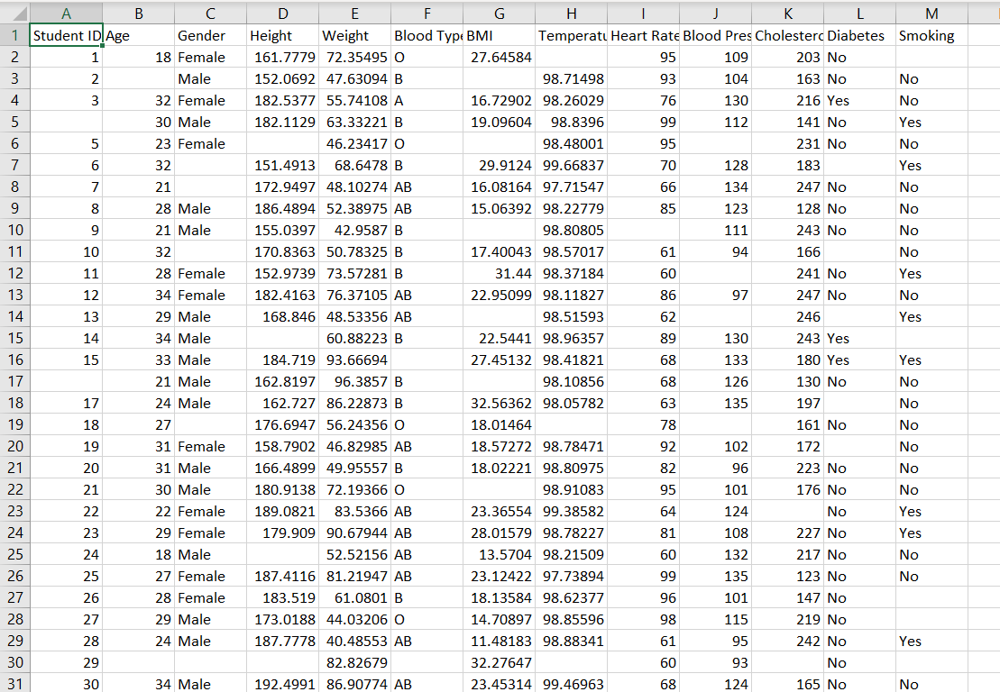
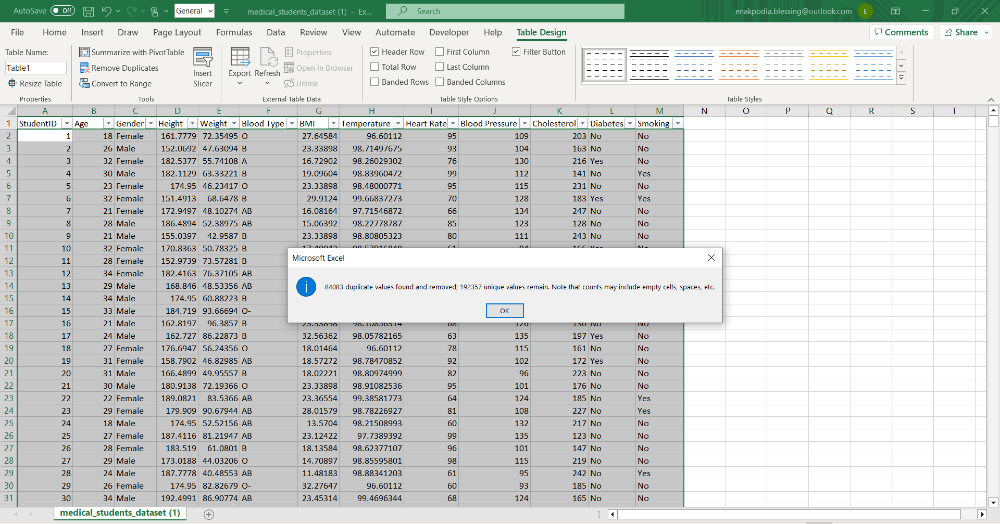
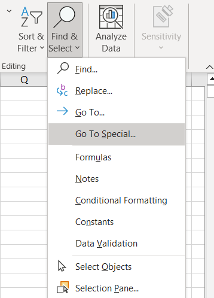
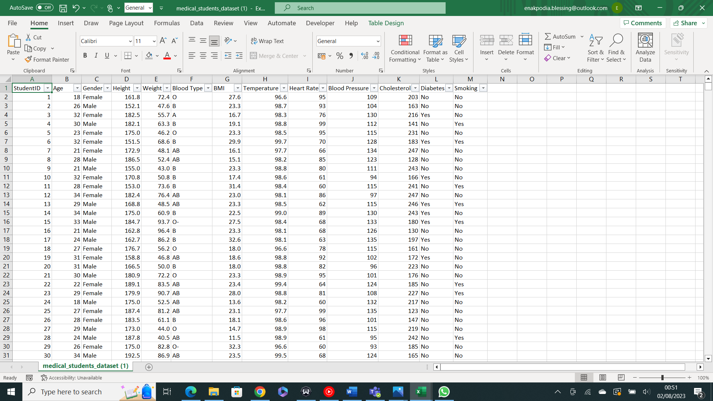
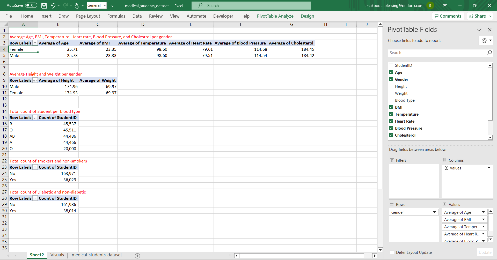
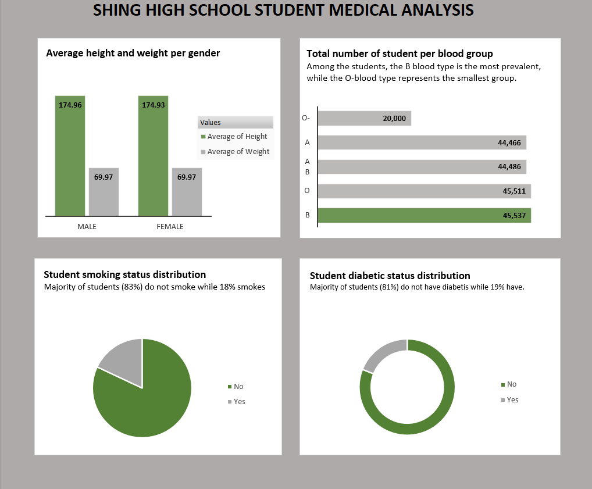

# Data Analysis on Medical-Records-of-Students-of-Shing-High-
# Introduction
This task marks the completion of week 2 of the Data Analysis Cohort 3 Excel training. This task was given by training facilitator Chinonso Promise to assess trainees' understanding of the use of pivot tables and pivot charts. 

Disclaimer: This is fictitious data.

# Skills Demonstrated 
For the successful completion of this project, the following Excel skills and tools were utilized.
1.	Data cleaning (Removing duplicates, Filling up blanks, and formatting in a table).
2.	Pivot table
3.	Pivot charts for visualisation.

# Dataset
This dataset was provided by the facilitator Chinonso Promise. It’s a dataset of students and their medical records ranging from BMI, temperature, blood type, height, etc. It consists of;
1. 13 columns
2. 192,356 rows
   
# Raw Dataset
This is a snapshot of the first 30 rows of the dataset

# Problem Statement. 
The project aims to, with the use of pivot tables and pivot charts, assess, analyze and visualize;

1. the average height, weight, BMI, temperature, and other relevant biometric data of students, segmented by gender (male and female). 
2. determine the total number of students per blood type
3. determine the proportion of students who smoke
4. determine the proportion of students diagnosed with diabetes
   
The stakeholders' interest lies in understanding the gender-specific distribution of these physical attributes and health conditions to devise targeted health interventions, smoking cessation programs, and diabetes management strategies. This data-driven approach will empower educational institutions, healthcare providers, and policymakers to implement effective measures to address gender-specific health concerns and improve the overall well-being and academic outcomes of students.

# Data Cleaning 
Firstly, I started off by checking for duplicates and highlighting them using **conditional formatting**, glanced through the highlighted data to ensure they’re duplicates before removing them using **remove duplicates** 

The dataset had 84,083 duplicates. 

Then, I went ahead to fill the blanks and as per the instructions of Facilitator Chinonso Promise;
1.	I used my discretion to fill the columns with categorical data based on the available options.
2.	For the studentID column, I generated sequential number series to fill in the blanks. 
3.	For the columns with numerical values (both discrete and continuous data), save for the StudentID column, the average value was used in filling up the blanks. 

To fill the blanks, I used the **Find and Select** option. 

# Cleaned dataset

# Data Analysis
When using a pivot table, colums from the dataset can either be put on the rows section, column section or value section depending on the problem being solved. Numeric values however are always on the values section and the values can be aggregated either by sum, count, average, Min, max, etc. Depending on the problem to be solved.

Aggregate functions are not the only functions that can be performed using the pivot table. There are a plethora of other functions that can also be performed like variance, standard deviation, etc.

For the purpose of this project, however, aggregate functions are the key focus.

# Data Visualisation

